## 学习过程中的问题

#### 平面有碰撞检测但是关了**Mesh Collider**还是有。碰撞检测一直找不到

> 原因是自己不小心将自动巡航组件(Nav Mesh Agent)。添加到了 Plane 物体上。使得 Plane 有碰撞检测。以后自己要小心一点，注意碰撞检测不只是在 Mesh Collider，其他组件也会有碰撞检测

### 为什么画布中的 Button 点击没响应###

> 原因是画布没有添加响应事件，光添加画布是不行的，要添加**EventSystem**事件，button 才能点击

## 生命周期

> **Awake()**:Awake is called when the script instance is being loaded
>
> - Awake()是在脚本对象实例化时被调用,

> **Start()** Start is called on the frame when a script is enabled just before any of the Update methods is called the first time
>
> - Start()是在对象第一帧时被调用的，而且是在 Update()之前

> **Update** 每一帧执行一次
> **lateUpdate** 跟随 Update() 后面执行

> **FixedUpdate** 固定时间调用一次 具体时间间隔可以在 编辑->项目设置->时间。 里面找到

> 执行顺序: Awake -> OnEnable -> Start
> 而 Awake Start 只会执行一次，当游戏物体被取消激活，再激活的时候脚本中的 Awake 和 Start 都不在执行 ,而 OnEnable 会重新在第一帧执行一次!

## 学习路径

> **22 节课**
> //旋转：欧拉角，四元数
> Vector3 rotate = new Vector3(0,30,0);
> Quaternion quaternion = Quaternion.identity;
> //欧拉角转为四元数
> quaternion = Quaternion.Euler(rotate);
> //四元数转为欧拉角
> rotate = quaternion.eulerAngles;
> //看向一个物体
> quaternion = Quaternion.LookRotation(new Vector3(0,0,0));

> **23 课**
> //绘制一条线 起点,终点
> Debug.DrawLine(new Vector3(1, 0, 0), new Vector3(1, 1, 0), Color.blue);
> //绘制一条射线 起点,射线
> Debug.DrawRay(new Vector3(1,0,0), new Vector3(1,1,0),Color.red);
> **射线的第二个向量是相对位置**

> **24 课程**
> public GameObject Cube 在界面把子物体挂在上去
> 可以获取子啊物体的属性
> 判断子物体是否被启用
> 在父节点上使用 public GameObject Cube; 让后把子物体 挂载上去
> GameObject.activeSelf 判断自身是否被启用（当前自身的激活状态）
> GameObject.activeInHierarchy 判断自身是否被启用以及父节点是否被启用（当前真正的激活状态）
> //获取其他组件
> BoxCollider bx = GetComponent<BoxCollider>();
>
> //获取当前物体的子物体身上的有个组件
> GetComponentInChildren<CapsuleCollider>(bx);
>
> //获取当前物体的父物体身上的某个组件
> GetComponentInParent<BoxCollider>();
>
> //添加一个组件
> gameObject.AddComponent<AudioSource>();
>
> //通过游戏物体的名称来获取游戏物体
> GameObject test = GameObject.Find("Test");
> Debug.Log(test.name);
>
> //通过游戏标签来获取游戏物体
> GameObject ObjByTagName = GameObject.FindWithTag("Player");
> Debug.Log(ObjByTagName.name);
>
> //设置物体的激活状体
> GameObject test2 = GameObject.Find("Test");
> test2.SetActive(false);

> **25 课程**
> //游戏开始到现在所花费的时间
> Debug.Log(Time.time);
>
>       //时间缩放值
>       Debug.Log(Time.timeScale);
>
>       //固定时间间隔
>       Debug.Log(Time.fixedDeltaTime);
>       计时器:
>          float timer = 0;
>          timer = timer + Time.deltaTime;

> **26 课程**
> Application 的应用
>
>       //游戏数据文件夹路径(只读，加密压缩)
>       Debug.Log(Application.dataPath+"/新建文本文档.txt");
>       //持久化文件夹路径
>       Debug.Log(Application.persistentDataPath);
>
>       //StreamingAssets文件夹路径(只读，可以放配置文件)
>       Debug.Log(Application.streamingAssetsPath);
>
>       //临时文件夹
>       Debug.Log(Application.temporaryCachePath);
>
>       //控制是否在后台运行
>       Debug.Log(Application.runInBackground);
>
>       //打开URL
>       Application.OpenURL("https://space.bilibili.com/67744423");
>
>       //退出游戏
>       Application.Quit();

> **27 课程** > 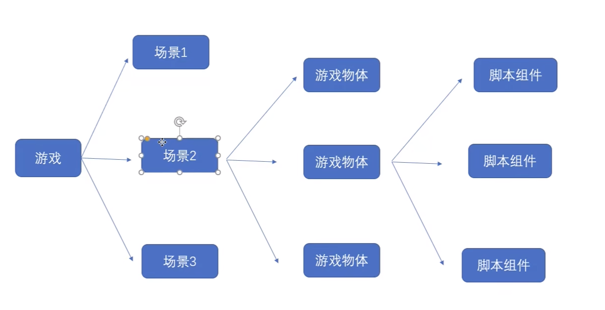
>
>       //两个类 场景类 场景管理类
>       //从此场景跳转到MyScene场景
>       SceneManager.LoadScene("MySence");
>
>       //获取当前场景
>       Scene scene = SceneManager.GetActiveScene();
>       Debug.Log(scene.name);
>
>       //场景是否被加载了
>       Debug.Log(scene.isLoaded);
>
>       //场景路径
>       Debug.Log(scene.path);
>
>       //场景索引
>       Debug.Log(scene.buildIndex);
>
>       //获取根路径的场景
>       GameObject[] go = scene.GetRootGameObjects();
>       Debug.Log(go.Length);
>
>       //场景管理类
>
>       //创建新场景
>       Scene scene1 = SceneManager.CreateScene("newScene");
>
>       //卸载场景
>       SceneManager.UnloadSceneAsync(scene1);
>
>       //加载场景
>       SceneManager.LoadScene("MySence",LoadSceneMode.Single);

> **28 课程**
> 异步加载场景并获取进度
>
> ```C#
>   void Start()
>   {
>       StartCoroutine(loadScene());
>   }
>
>   //协程方法用来异步加载场景
>   IEnumerator loadScene()
>   {
>       operation = SceneManager.LoadSceneAsync(1);
>       //加载完场景不要跳转
>       operation.allowSceneActivation = false;
>       yield return operation;
>   }
>   float timer = 0;
>   // Update is called once per frame
>   void Update()
>   {
>       //显示加载进度 0-0.9
>       Debug.Log(operation.progress);
>       timer += Time.deltaTime;
>       if (timer>5)
>       {
>           operation.allowSceneActivation = true;
>       }
>   }
> ```

> **29 课程**
> 位置旋转缩放来聚齐 ，了解 Transform
> 物体之间的**子集是由 transform 决定的！！！** 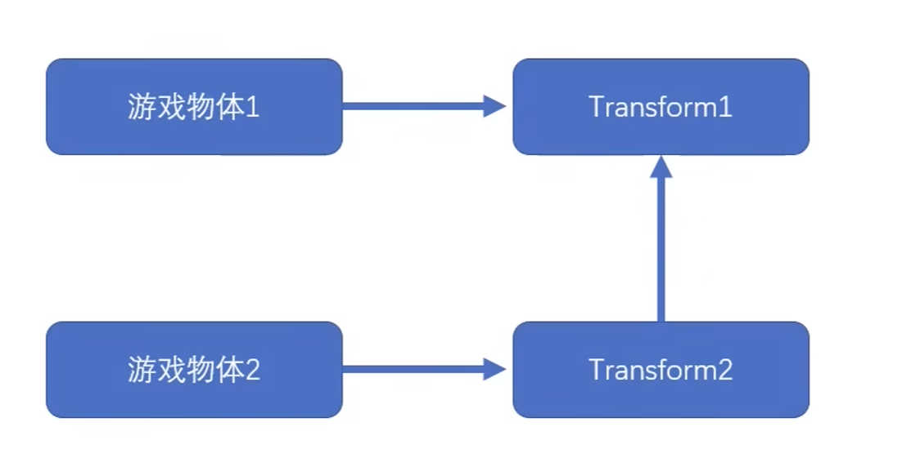
>
> - 获取 transform 信息
>
>        //获取位置
>        Debug.Log(transform.position);
>        Debug.Log(transform.localPosition);
>
>        //获取旋转
>        Debug.Log(transform.rotation);
>        Debug.Log(transform.localRotation);
>        //欧拉角
>        Debug.Log(transform.eulerAngles);
>
>        //获取缩放
>        Debug.Log(transform.localScale);
>
>        //向量
>        Debug.Log(transform.forward);
>        Debug.Log(transform.right);
>        Debug.Log(transform.up);
>
> - 获取子父物体对象
>
>         //获取父物体
>       var Obj = transform.parent.gameObject;
>
>        //子物体的个数
>        Debug.Log(transform.childCount);
>
>        //解除与子物体的父子关系
>        transform.DetachChildren();
>
>        //获取子物体
>        Transform trans = transform.Find("child");
>        transform.GetChild(0);
>
>        //判断一个物体是不是另外一个物体的子物体
>        bool res = trans.IsChildOf(transform);
>        Debug.Log(res);
>
>        //设置为父物体
>        trans.SetParent(transform);
>
> - 给 transform 赋值 一下函数在 void Update(){} 中执行 每一帧执行一次
>
>         //时时刻刻看向000点
>        transform.LookAt(Vector3.zero);
>
>        //旋转
>        transform.Rotate(Vector3.up, 1);
>
>        //绕某个轴旋转
>        transform.RotateAround(Vector3.zero, Vector3.up, 1);
>
>        //移动
>        transform.Translate(Vector3.forward * 0.1f);

> **30 课程**
> 获取鼠标，键盘的事件
>
> - 鼠标
>
>        //鼠标的点击
>        //按下鼠标 0 左键 1 右键 2 滚轮
>        if (Input.GetMouseButtonDown(0))
>        {
>        Debug.Log("按下了鼠标左键");
>        }
>        //持续按下鼠标
>        if (Input.GetMouseButton(0))
>        {
>        Debug.Log("持续按下了鼠标左键");
>        }
>
>        //抬起鼠标
>        if (Input.GetMouseButtonUp(0))
>        {
>        Debug.Log("抬起了了鼠标左键");
>        }
>
> - 键盘
>
>        //按下键盘按键
>        if (Input.GetKeyDown(KeyCode.A))
>        {
>        Debug.Log("按下了 A");
>        }
>        //抬起键盘按键
>        if (Input.GetKeyUp(KeyCode.A))
>        {
>        Debug.Log("抬起了 A");
>        }
>
>        //持续按下按键
>        if (Input.GetKey("a"))
>        {
>            Debug.Log("持续按下A");
>        }

> **31 课程**
>
> **虚拟轴的使用** > 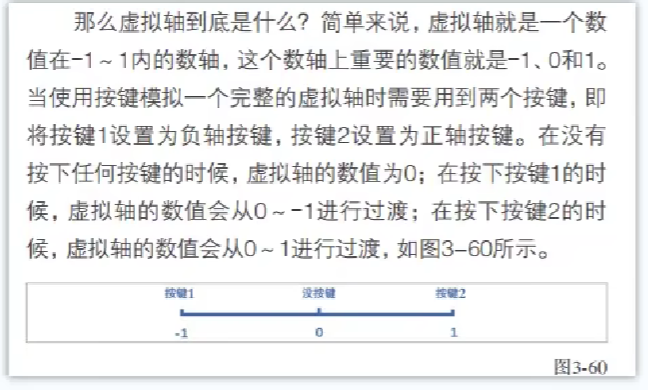
> 虚拟轴的设置在设置->项目设置->输入设置，中进行设置.
>
>         //获取水平轴
>         float horizontal = Input.GetAxis("Horizontal");
>         //获取垂直轴
>         float vertical = Input.GetAxis("Vertical");
>         Debug.Log(horizontal+" "+vertical);
>
>        //虚拟按键
>        if (Input.GetButtonDown("Jump"))
>        {
>            Debug.Log("按下空格");
>        }
>        if (Input.GetButton("Jump"))
>        {
>            Debug.Log("持续空格");
>        }
>        if (Input.GetButtonUp("Jump"))
>        {
>            Debug.Log("抬起空格");
>        }

> **32 课程**
>
> **触屏 触摸方式**
> //触摸方法使用
> Input.multiTouchEnabled = true;
> //判断单点触摸
> if (Input.touchCount == 1)
> {
> //触摸对象
> Touch touch = Input.touches[0];
> //触摸位置
> Debug.Log(touch.position);
>
>            //触摸阶段
>            switch (touch.phase)
>            {
>                case TouchPhase.Began:
>                    break;
>                case TouchPhase.Moved:
>                    break;
>                case TouchPhase.Stationary:
>                    break;
>                case TouchPhase.Ended:
>                    break;
>                case TouchPhase.Canceled:
>                    break;
>                default:
>                    break;
>            }
>        }
>        //判断多点触摸
>        if (Input.touchCount == 2)
>        {
>            Touch touch = Input.touches[0];
>            Touch touch1 = Input.touches[1];
>        }

> **33 课程**
>
> **灯光与烘焙**
> 灯光在任何地方照射的角度都一样
> spot：像手电筒一样照射
> Directional： 实时照射
> Point: 像电灯一样照射
> Area: 烘焙
> 烘焙: 需要在烘焙的物体上点击右上角 Static 按钮旁边的下拉按钮 Contribute GI 让后在 Windows -> Rendering -> lighting 选择 Generate Ligthing 中进行烘焙

> **34 课程 (摄像机)**
>
> - 透视摄像机 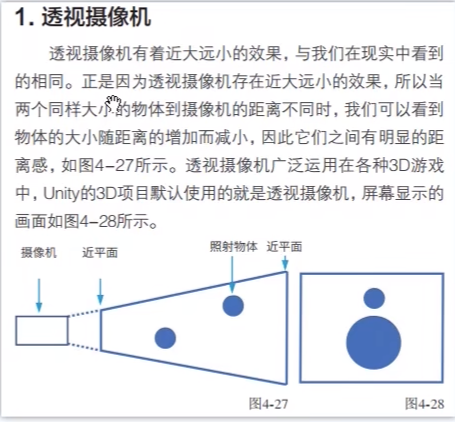
> - 正交摄像机 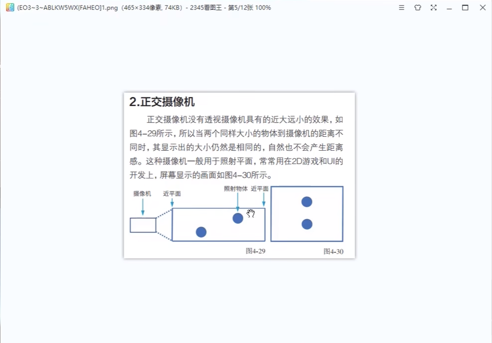
> - 设置正交或者透视在 Projection 中设置
> - Claer Flags:
>
>        1. SkyBox天空盒 在 Claer Flags 中设置 SkyBox。 在添加组件 Rendering->SkyBox ,让后选取 SkyBox 的选项就可以渲染天空
>        2. Solid Color (纯色)将拍不到的东西以纯色来进行填充
>        3. Dont't Clear （不清除）拍不到的以黑色来填充
>        4. Depth only(仅深度) 将此物体未填充的地方用比此物体更小的Depth权限来进行填充显示
>
> - Culling Mask
>
>        剔除遮罩：选择显示或者不显示的层。在对于的物体 Layer 中设置层标签。
>
> - Clipping Planes (视野)
>
>        提供相机的视野长短距离
>
> - Viewport Rect
>
>        提供当前相机在整块屏幕的占比大小
>
> - Depth (深度)
>
>        提供当前相机的权重,权重越高越先显示
>
> - Target Texture(目标纹理)
>
>        将当前的相机照射的图片映射到纹理上。在Assets文件夹中添加Render texTure纹理 让后将其拖入Target Texture，相机照射的图片将会映射到纹理中
>
> - Target Display(目标显示)
>
>        当前相机的Inspector中的显示选项要和窗口"动画"里的Display选项一样才会显示

> **35 课程**
>
> **游戏声音**
> 一个场景多个摄像机都有音效的话可能会冲突。
> 播放声音：在场景物体上添加声音(Audio Sound) 让后将音频拖入 AudioClip 里面即可。
> 用代码控制播放: 将脚本挂在到物体下方,声明属性后将音频 挂载到物体脚本上
>
> ```C#
>    void Start()
>   {
>       //获取组件
>       player = GetComponent<AudioSource>();
>       //设定播放的音频片段
>       player.clip = music;
>       //循环
>       player.loop = true;
>       //音量
>       player.volume = 0.5f;
>       //播放
>       player.Play();
>   }
>    // Update is called once per frame
>   void Update()
>   {
>       //按空格切换声音的播放和暂停
>       if (Input.GetKeyDown(KeyCode.Space))
>       {
>           //如果当前正在播放声音
>           if (player.isPlaying)
>           {
>               //暂停
>               //player.Pause();
>               //停止
>               player.Stop();
>           }
>           else
>           {
>               //继续
>               //player.UnPause();
>               //开始播放
>               player.Play();
>           }
>       }
>        //按鼠标左键播放声音
>       if (Input.GetMouseButtonDown(0))
>       {
>           player.PlayOneShot(se);
>       }
>   }
> ```

> **36 课程**
>
> **视频播放器**
>
> - 手动实现
>   在物体中添加**Video player 组件**将视频拖入到**Video clip**中。将渲染模式 更改为：渲染器纹理，Assets 文件夹中在新建一个**渲染器纹理**将其拖入到目标纹理上。此时**渲染器纹理**便可以拖入到物体上进行播放。
> - 代码实现
>   新建脚本挂载到物体上,
>
> ```C#
>     void Start()
>    {
>        player=GetComponent<VideoPlayer>();
>        player.Play();
>    }
>
>    // Update is called once per frame
>    void Update()
>    {
>        if (Input.GetMouseButtonDown(0))
>        {
>            if (player.isPlaying)
>            {
>                player.Pause();
>            }
>            else
>            {
>                player.Play();
>            }
>        }
>    }
> ```

> **37 课程**
>
> **控制器的使用**
>
> - 为目标物体添加**Character Controller**组件 ，让后再添加脚本将其挂载到目标物体上
>
> ```C#
>    private CharacterController player;
>    // Start is called before the first frame update
>    void Start()
>    {
>        player = GetComponent<CharacterController>();
>    }
>
>    // Update is called once per frame
>    void Update()
>    {
>        //水平轴
>        float horizontal = Input.GetAxis("Horizontal");
>        //垂直轴
>        float vertical = Input.GetAxis("Vertical");
>
>        Vector3 dir = new Vector3(horizontal, 0, vertical);
>        //Debug.Log(transform.position);
>        Debug.DrawRay(transform.position, dir, Color.red);
>
>        //移动
>        player.SimpleMove(dir*2);
>    }
> ```

> **38 课程**
>
> **给物体添加重力**
> 给物体添加 **Rigidbody 组件**物体就会有重力效果,组件**Rigidbody 的属性**可以设置质量，阻力,使重力则让物体具有重力效果,

> **39 课程**
>
> **注意**
> 正常情况下物体之间添加了物理属性还是会重叠
> 只有在运行的时候才会体现物理属性
> **物体产生碰撞**
> 给物体加上 **1.Rigidbody 组件**使得物体有重力
> 给物体加上 **2.Collider 组件**使得物体有碰撞效果
> 给物体挂载上脚本
>
> ```C#
>     //创建一个爆炸的预制体
>    public GameObject Prefab;
>    //监听发生碰撞
>    private void OnCollisionEnter(Collision collision)
>    {
>        //创建一个爆炸的物体
>        Instantiate(Prefab, transform.position, Quaternion.identity);
>        //销毁自身
>        Destroy(gameObject);
>        //获取碰撞到的物体
>        Debug.Log(collision.gameObject.name);
>    }
>
>    //持续碰撞中
>    private void OnCollisionStay(Collision collision)
>    {
>
>    }
>
>    //结束碰撞
>    private void OnCollisionExit(Collision collision)
>    {
>
>    }
> ```
>
> 1. 可以在声明 GameObject 后在 Unity 中拖入产生爆炸的特效
> 2. 让后可以在爆炸特效中挂载脚本 倒计时自我摧毁

> **40 课程**
>
> **触发器，触发与碰撞的区别**
> 将一个物体设置为触发器,添加**Colider 组件**选择其组件中的性质**是触发器** 此时其他物体就可以进入触发器，进而触发事件，（可以将 触发器中的网格**mesh renderer**取消选项这样触发器就透明了），将脚本挂载到触发器的下面
>
> ```C#
>    //触发器和碰撞器 不一样，碰撞器传入的是碰撞类
>    //碰撞触发器
>    private void OnCollisionEnter(Collision collision)
>    {
>
>    }
>
>    //触发器(进入时触发)
>    private void OnTriggerEnter(Collider other)
>    {
>        GameObject door = GameObject.Find("Door");
>        if (door != null)
>        {
>            door.SetActive(false);
>        }
>    }
>
>    //触发器(在触发当中)
>    private void OnTriggerStay(Collider other)
>    {
>
>    }
>
>    //触发器(触发结束)
>    private void OnTriggerExit(Collider other)
>    {
>
>    }
> ```

> **41 课程**
>
> **铰链 弹簧 特殊的物理关节**
>
> - hinge joint(铰链)
>
>        物体添加上这个属性后物体便会固定，围绕这一个铰链进行旋转**Anchor**便可以对物体设置铰链的位置在中心是 0，向上 x 偏移为 0.5，向下 X 偏移未-0.5，yz 同理
>
> - Spring Joint（弹簧）
>
>        将两个物体链接起来像弹簧一样，在组件中添加Spring Joint，让后将另一个组件拖入到ConnectedBody中
>
> - Fixed Joint(固定链接)
>
>        和弹簧一样但但是固定的不会抖动

> **42 课程**
>
> **游戏中的红外线 射线检测**
>
>        物体在倾斜面会向下滑，但是前提需要添加一个**物理材质**的 Assets 让后可以在里面设置物理材质的摩擦系数等。让后将此物理材质挂载到物体的材质上便可以使得。此物体有摩擦系数了

> **43 课程**
>
> **游戏中的红外线 射线检测**
> 在游戏中点击物体 照相机的平面摄像机向点击的点进行投射,
>
> ```c#
>    void Update()
>    {
>        if (Input.GetMouseButtonDown(0))
>        {
>            //按下鼠标左键发射射线
>            Ray ray = Camera.main.ScreenPointToRay(Input.mousePosition);
>            //声明一个碰撞信息类
>            RaycastHit hit;
>            //碰撞检测
>            bool res = Physics.Raycast(ray, out hit);
>            //如果碰撞到的情况下，hit就有内容了
>            if (res == true)
>            {
>                Debug.Log(hit.point);
>                transform.position = hit.point;
>            }
>            //多检测
>            RaycastHit[] hits = Physics.RaycastAll(ray,100,1<<10);
>        }
>    }
> ```

> **44 课程**
>
> **粒子系统的基本使用**
>
> - 发射
>
>       测试设置产生的粒子数以及距离
>
> - 形状
>
>       火焰发出时的形状
>
> - 生命周期内颜色
>
>       设置火焰从发射到结束时的颜色渐变
>
> - 生命周期内大小
>
>        设置粒子从开始到结束时候的粒子大小

> **45 课程**
>
> **线条划线 和 拖尾**
>
> - Line Renderer（划线）
>
>        主要作用是划线,像水果忍者中的刀光，还有一些涂鸦的小游戏，包括让鼠标划线然后让对象进行跟踪导航也可通过此插件完成
>
> - trail renderer(拖尾)
>
>        主要作用是:带有尾巴的特效

> **46 课程(旧版动画)**
>
> **制作简单的游戏动画**
>
>        点击窗口,点击动画,再点击动画,出现了动画窗口,点击将要创建动画的物体。
>        在动画窗口创建一个动画剪辑right。让后添加属性（Transform ，旋转啊什么的）。
>        在动画编辑器中便可以编辑动画的移动方式了。在要移动的物体上添加Animations组件。
>        将刚刚创建好的Assets动画Up 添加到Animation上。再选择动画即可。

> **47 课程(新版动画)**
>
> 新版的动画使用的是 Animator 组件（可视化编程）其中添加动画与旧版一样。
> 但是选择动画播放的时候可以使用动画编辑器。在动画编辑器中点击动画让后点击**设置为默认状态**
> 也可以使用代码进行播放设置
>
> ```C#
>    private Animator animator;
>    // Start is called before the first frame update
>    void Start()
>    {
>        animator=GetComponent<Animator>();
>    }
>
>    // Update is called once per frame
>    void Update()
>    {
>        if (Input.GetMouseButtonDown(0))
>        {
>            animator.Play("47_goLeft");
>        }
>    }
> ```

> **48 课程**
>
> **角色动画的使用**
> 引入包**Character Pack: Free Sample**后
>
> - 拖入角色,在角色中添加**Animator**组件让后将相应的动作拖入到动画器中即可，
> - 可以选择过度将两个动作相连接
> - 在动画器点击过度线条，参数中添加 **Tigger**来使得，动作过度有限制,
> - 可以在代码中控制**Tigger**
> - 可以选择，过度中的**有退出时间**来选择是否强制中断动画
>
> ```C#
>    void Update()
>    {
>        if (Input.GetKeyDown(KeyCode.F))
>        {
>            GetComponent<Animator>().SetTrigger("pickup");
>        }
>    }
> ```

> **49 课程**
>
> **使得角色动起来**
>
> - 在 Assets 中创建**动画控制器**
> - 在人物检查器中创建**Animator** 属性将动画检查器赋值上去,在动画器中编写**站立**和**跑步**的动作
> - 在动画器中添加参数 Bool 控制是否开始跑步
> - 在过度的节点上将**IsRun**添加上去从站立到跑步**IsRun**为 Ture，从跑步到站立**IsRun**为 false；
> - 在 Settings 中将**过度持续时间**设置为 0 更有利于反馈更快，但是会唐突
>
> ```C#
>    private Animator animator;
>    // Start is called before the first frame update
>    void Start()
>    {
>        animator=GetComponent<Animator>();
>    }
>
>    // Update is called once per frame
>    void Update()
>    {
>        //水平轴
>        float horizontal = Input.GetAxis("Horizontal");
>        //垂直轴
>        float vertical = Input.GetAxis("Vertical");
>        //向量
>        Vector3 dir = new Vector3(horizontal, 0, vertical);
>        //当用户按下了方向键
>        if (dir != Vector3.zero)
>        {
>            //面向向量
>            transform.rotation = Quaternion.LookRotation(dir);
>            //播放奔跑的动画
>            animator.SetBool("IsRun",true);
>            //朝向前方移动
>            transform.Translate(Vector3.forward*2*Time.deltaTime);
>        }
>        else
>        {
>            //播放站立动画
>            animator.SetBool("IsRun",false);
>        }
>
>    }
> ```

> **50 课程**
>
> 在下载的资源上，后缀名为.FBX 的文件上
>
> - Rig 可以设置动画类型
> - animation 可以设置裁剪播放等

> **51 课程**
>
> **角色挥拳特效, 曲线和帧事件的使用**
> 在动画器中，双击对应的动作 里面的**Animation**
>
> - 循环时间右边的绿灯表示循环的时候物体的动作是否流畅
> - 曲线表示物体运动的时候所输出的值,将曲线的名字与动画器中的参数 Float 多对应，就可以在脚本中 使用 animator.GetFloat("Test")。将参数取出，此特性可以应用在挥拳特效由强变弱的例子上
> - 事件：可以根据所播放的动画帧插入对应的事件将事件的函数取名后。在对应挂载脚本的 Class 中声明此函数 ，那么在动画播放到这一帧的时候将会触发这个事件，可以使用在人物左右脚踏出的时候发出声音或者做出特效

> **52 课程**
>
> **连跑带走 混合动画**
> 在物体对应挂载的混合控制器中 。右键点击**创建状态**
>
> - 空
>
>         的话是什么都没有。但是可以自定义
>
> - 混合树
>
> 混合树的话可以点进去，在里面 Parameter 参数可以调节，
> 其参数来源于，动画器中的参数添加。可以在检查器中添加一个或者多个运动域。在运动域中可以拖入动作动画,可以多个动画叠加。具体的运动方式由 Parameter 的参数决定。混合树还可以嵌套混合树

> **53 课程**
>
> **动画太多 怎么叠加**
> 当一个动画的动画控制器中的。动画太多。可以使用。参数下面的加号，加上一个动画遮罩层。则权重高的遮罩层会先动，当然权重也可以叠加，，但是有时候遮罩层会相互覆盖。
> 在资源中，新建遮罩骨骼,(Avator 遮罩),选择人形。让后将遮罩的地方变红，运动的地方变绿,放入到动画器的遮罩层中，那么当不运动的骨骼且被遮罩的，将会用下一层的骨骼。

> **54 课程**
>
> **走哪里 指哪里 反向动力学**
> 在人物的动画器中有 IK 处理(骨骼处理),点击勾选
> 在物体的属性中声明:
> public Transform target;
> 在监听方法中便可以使用 IK 的 API
>
>                //IK 写到这个方法内
>                private void OnAnimatorIK(int layerIndex)
>            {
>                //设置头部IK
>                animator.SetLookAtWeight(1);
>                animator.SetLookAtPosition(target.position);
>                //设置右手IK权重
>                animator.SetIKPositionWeight(AvatarIKGoal.RightHand,1);
>                //旋转权重
>                animator.SetIKRotationWeight(AvatarIKGoal.RightHand,1);
>                //设置右手IK
>                animator.SetIKPosition(AvatarIKGoal.RightHand,target.position);
>                animator.SetIKRotation(AvatarIKGoal.RightHand,target.rotation);
>            }

> **55 导航网格的使用**
>
> **导航**
>
> - 将要导航的物体 选择为 （navigation Static） 静态导航
> - 选择**窗口** -> **AI** ->**导航**
> - 在烘焙中有
>
> 1. 代理半径 : 物体的半径
> 2. 代理高度: 物体能穿过的高度
> 3. 最大坡度: 物体能上升的坡度
> 4. 步高: 物体能跨越的高度
>
> - 点击 bake 进行烘焙，就能显现出物体的行走路线

> **56 课程**
>
> **AI 自动导航**
> 在要移动的物体上添加**Nav Mesh Agent 组件**
> 在对应的脚本类中获取其实体,
>
> ```C#
>    private NavMeshAgent agent;
>    // Start is called before the first frame update
>    void Start()
>    {
>        //获取代理组件
>        agent = GetComponent<NavMeshAgent>();
>    }
> ```
>
> 让后在 Update()函数中写出点击鼠标，移动位置
> 特别注意 ：Physics.Raycast(ray, out hit);是检测碰撞
>
> ```C#
>    void Update()
>    {
>        //如果按下鼠标
>        if (Input.GetMouseButtonDown(0))
>        {
>            //获取点击位置
>            Ray ray = Camera.main.ScreenPointToRay(Input.mousePosition);
>            RaycastHit hit;
>            //检测碰撞
>            Physics.Raycast(ray, out hit);
>            if (Physics.Raycast(ray,out hit))
>            {
>                //点击位置
>                Vector3 point = hit.point;
>                //设置该位置为导航目标点
>                agent.SetDestination(point);
>            }
>        }
>    }
> ```

> **57 动态障碍物与**
> 在进行导航烘焙的时候，有些自动门，打开后还是不能导航过去，这时候可以给这个物体，**解除 Navigation Static**，让后**添加 Nav Mesh Obstacle**就可以在非静态的物体上进行烘焙路线。
>
> - **切割按钮**: 让非静态物体移动的时候可以实时烘焙，
>
> 1. 其中 移动阈值表示非静态物体移动多远才进行切割
> 2. 静止时间: 表示物体停留多久进行切割
> 3. 仅在静止时切割：表示非禁止物体实时切割，此功能虽好但是对性能消耗较大
>
> - **网格链接** 1.跳跃 在**导航栏中**选择相应的物体，再对应的选择**高度**和**跳跃距离**,再在对象中选择**Generate OffMeshLinks**，再进行烘焙，就可以在相应的物体上跳跃和掉落。
>
> 2. 传送, 在其中一个物体上添加**Off Mesh Link**将要传送的两个物体拖入其中, 当角色进入其中时，便可以传送。

> **58 区域导航**
>
> 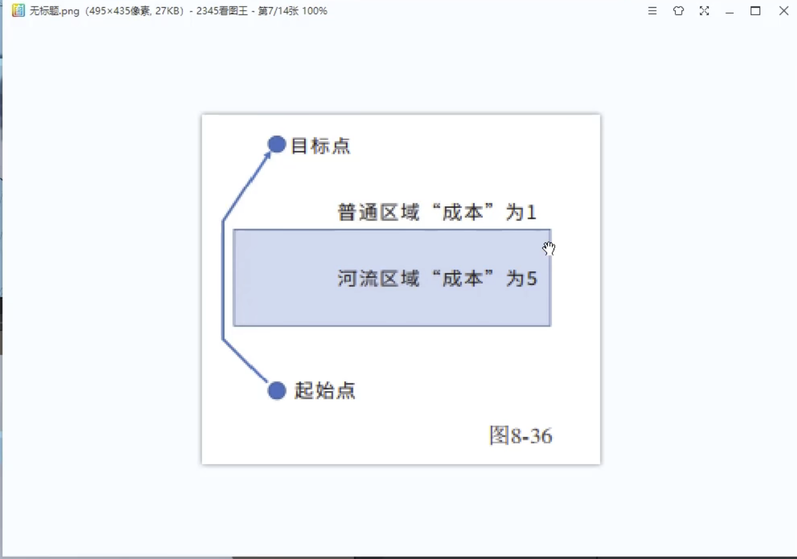
>
> 当有河流在中间，河流的权重为 5，而其他区域的权重为 1。那么可以选择穿过河流消耗的体力小还是，绕着普通区域的消耗小。
> 在右侧**Navigation**面板选择 Areas，在里面添加 water，和选项权重。
> 在要生成的河流物体上选择**Navigation Static**
> 在**Navtgation**面板中选择**Object**点击**Navigation Static** 让后点击烘焙。
> 此时物体在移动的时候就会在普通面，和河流之间选择权重较为小的距离。

> **59 绘制 UI 先准备一张画布**
>
> 1. 右键 **Hierarchy(层次面板)**，**创建 UI**,点击创建 **Canvas(画布)**。创建画布的时候还会顺便创建相应的**EventSystem 事件**对应的是点击事件
> 2. 画布的 **Render Mode（渲染模式)**
>
> - **Overlay**无论前方物体放置什么东西，画布总是在最上方。
> - **Camera**需要将一个相应的相机拖入到**Render Camera**，那么此画布将会一直跟随此相机移动
> - **World Space**世界相机，可以随便旋转，调整大小
> - **Sort Order** 当有多个相同的画布的时候显示的优先级
> - 画布的**UI Scale Mode**中 **constant Pixel Size**是会随着屏幕的分辨率大小改变而改变的。而**Scale with Screen Size**则是会随着屏幕分辨率大小的改变而固定，图片不会发生该改变。

> **60 UI 基础 锚点和轴心点**
>
> 1. 在创建画布后，其中在里面再创建的 Image 有以下属性
>
> - Source Image :选择图片来源
> - Raycast Target :当点击图片的时候，是否检测射线，不检测的话射线会穿过图标。
> - Image Type ：可以选择图片的形式例如：平铺，裁片等。
> - 按钮**Set Native Size**设置原生大小,点击的话，将会将当前的图片设置为原生的图片大小。
>
> 2. 每个组件都有个**锚点**。**锚点**是固定在父物体上的，**锚点**是设置在父物体上的。
> 3. 在 Canvas(画布中),添加的 image，其中锚点会根据，画布中的四个尖尖角进行坐标系分布，XY 轴的范围分别是 0-1。若是将 image 拖入这四个尖角当中，那么图片的距离四个边角的距离不变，所以在不同屏幕上的时候，此图片会随着屏幕的扩大而适应。
> 4. **轴心点** 相当于相框的图钉,图片的旋转，扩大，坐标都是由轴心点为基准。**更详细的说，锚点的坐标确定，是由轴心点确定的**

> **61 文本使用**
>
> 物体**Text**其中 **Horizontal Overflow**表示，水平溢出，**vertical**表示垂直溢出。
> 勾选**Best Fit**表示字体自动填充相应的文本框。

> **62 画布中的 Button**
> Button 中的**Interactable**选中极为启用，不选用极为不启用。其中**Select Sprite**表示选中的状态图片
>
> - **Transition**则是可以选择，button 按钮的特效等.
> - **Navigation** 导航则是可以让多个按钮之间相互跳转。
> - **Button**的点击事件怎么做？
>
> 1. 先创建一个脚本，将其挂在到随意一个物体上。
> 2. 随意创建脚本里面的一个方法。
> 3. 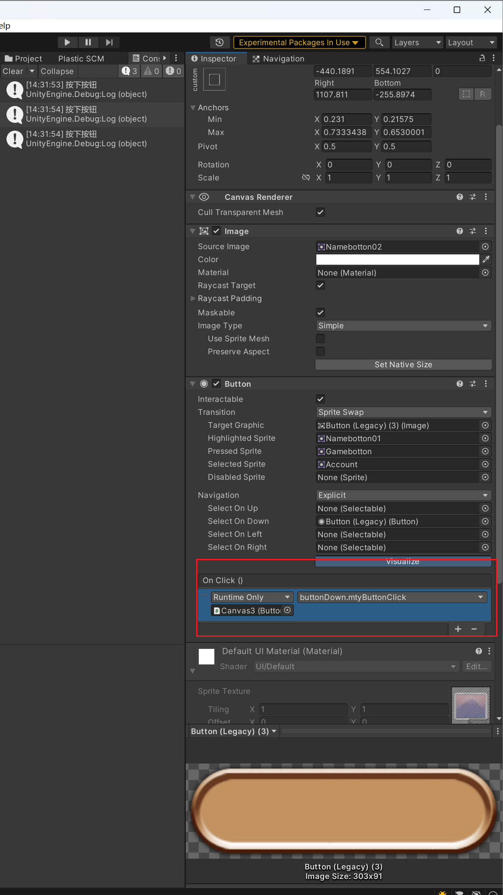在按钮上选择 On Click();让后添加一个事件
> 4. 将被脚本挂载的物体拖入到此。让后选择对应的方法。就可以实现挂载。

> **63 输入账号密码 文本框的使用**
>
> 在画布中还有一个叫**Input Field 的组件**
>
> - Placeholder 可以当作使用占位符
> - Content Type 可以设置文本框输入的类型。
>
> 1. 实现一个输入字符则输出字符的事件
>
> - 在随便一个物体上挂载脚本，
>
> ```C#
>     public InputField inputField;
>    // Start is called before the first frame update
>    void Start()
>    {
>
>    }
>
>    // Update is called once per frame
>    void Update()
>    {
>
>    }
>
>    public void mtyTest()
>    {
>        Debug.Log("测试输入");
>    }
>
>    public void TextChanged()
>    {
>        Debug.Log(inputField.text);
>    }
> ```

- 其属性声明的 **inputField** 将对应的 inputField 拖入其中,便获得了其实例。
- 在 **TextChanged**方法中就可以打印输出。
- 那么怎么触发事件呢？在文本的 Inspector 面板中，挂载其物体，并且选择其方法：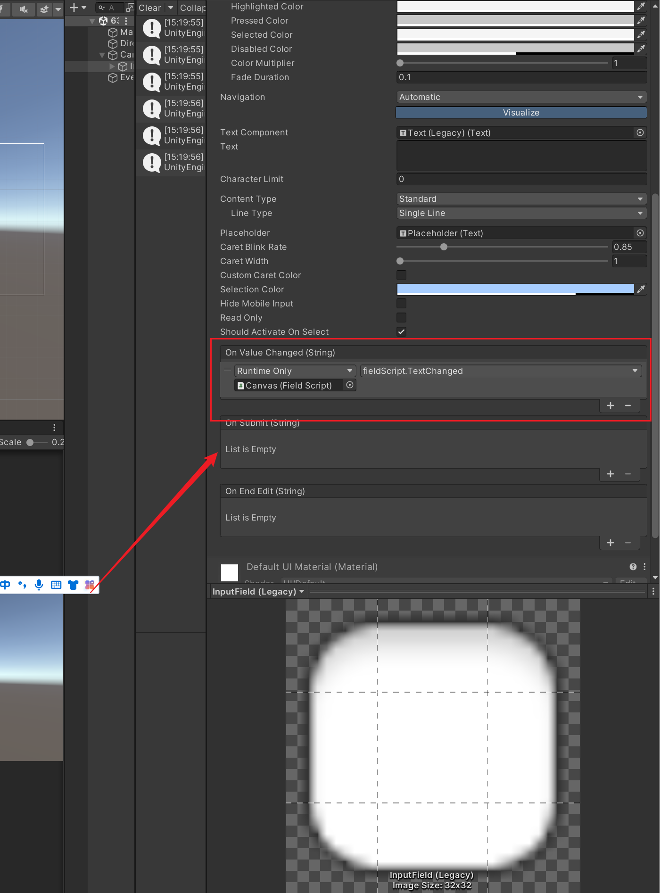

> **64 选择与下拉框的使用**
>
> - Toggle 选择按键
> - Dropdown 下拉框
>   在下拉框中添加选项：
>   在此下拉框中添加一个脚本:
>
> ```C#
>    void Start()
>    {
>        //获取下拉组件
>        Dropdown dropdown = >GetComponent<Dropdown>();
>        //获取组件的选项
>        List<Dropdown.OptionData> options >= dropdown.options;
>        //修改选项
>        options.Add(new Dropdown.>OptionData("俄罗斯"));
>        dropdown.options = options;
>    }
> ```

> **65 滚动条与滑动条的使用**
>
> 1. slider 滚动条：其中包含的组件有三个。
>
> - Background： 背景颜色灰色的滚动条。
> - Fill Area : 填充高亮的区域。
> - Handle Slide Area : 滚动条的原点。

> **66 面板的使用**
> 当在画布中,图标的时候，例如血条，设置等图标，但是当画布的大小变更，或者是分辨率的变更，那么图标可能产生位移,那么你可能想到用锚点,但是当图片过多的时候,不可能每个锚点都变更,那么此时就要用到面板 Panel,
> 将要定位的物体拖入到其中那么里面的物体将会根据父定位，panel 面板的大小，所以你只需要设置面板的锚点即可
> 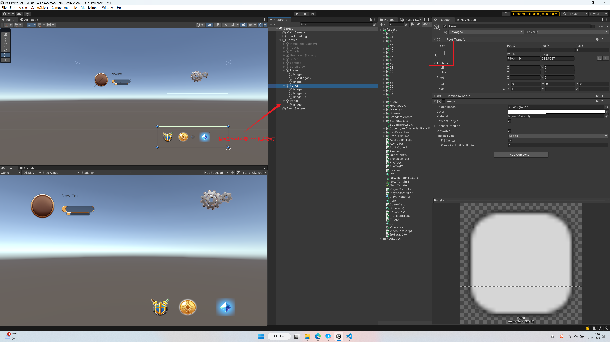

> **67 常用 UI**
>
> 1. 当两个 Image 组件成为父子关系的时候,子类 image 添加图片,是可以移出父类物体的，但是当父类物体添加了 Mask 遮罩，那么子类物体移出去将会被遮盖。
>    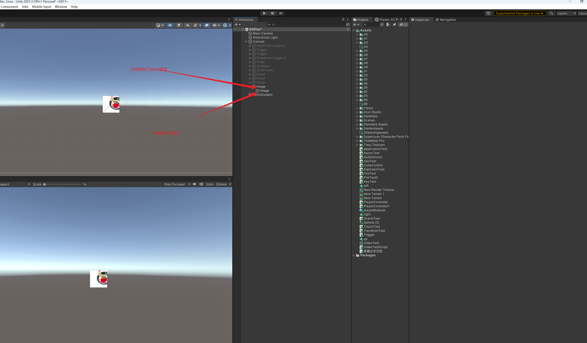
> 2. 当在画布上创建一个文本框 Text,那么里面的文字变多，而其边框的大小不会跟着改变,向此物体添加,Content Size Fitter 控件，旋转水平适应(Horizontal)，或者垂直适应（Vertical Fit）,那么文本框的大小会随着字体大小的改变而改变。
> 3. 垂直/水平控件, 当面板上的子物体在排列的时候。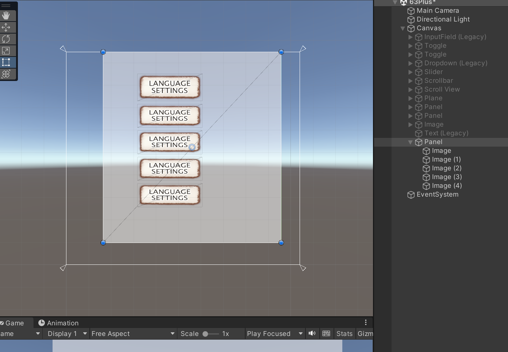虽然里面的控件都在面板里面可以锚点对齐，但是当面板也改变了呢？？，这时候需要用到组件 Vertical Layout Group， 水平对齐组件，当然也有垂直对齐组件。在里面就可以设置子物体对齐的方式了。
>    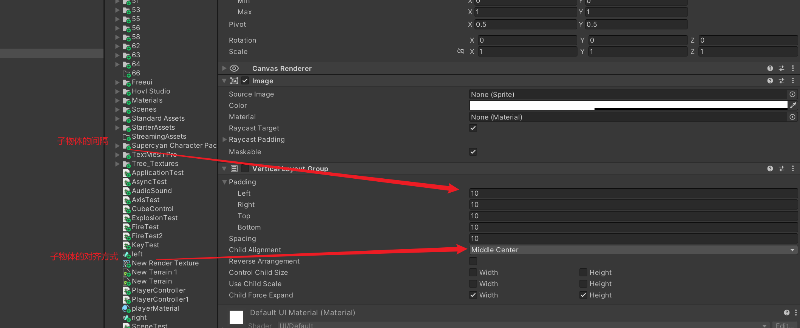
>    其中还有 水平布局,Horizontal Layout Group
>    还有网格布局 :Grid Layout Group
> 4. 其中 Scroll View，UI 也有其中的组件。
>
> - content Size 组件可以帮助 Scroll View 适应文本大小
> - 注意！在 Scroll View 在有三个组件 横向滑动条，纵向滑动条，已经内容，要想内容给与网格布局的话，需要将 Grid Layout Group 组件添加到内容下面，而不是其他组件下面。
